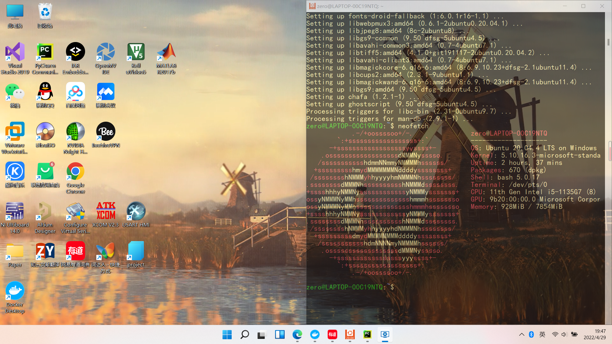

Git with pycharm上传至GitHub

切换分支：checkout
合并分支：Merge into Current
参考：https://blog.csdn.net/Q0717168/article/details/108719275

win11 wsl2 ubuntu20.4 安装使用
参考：https://docs.microsoft.com/en-us/windows/wsl/

以及解决E：Failed to fetch  通过改变DNS
参考：https://jingyan.baidu.com/article/ca41422f7ed0831eae99ed24.html

